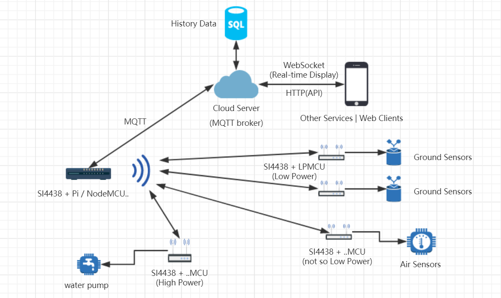

# LoRa PLAN

## System Architecture

## Objectives
 - Available
 - Reliable

## Devices
 - VPS x1
 - Gateway(Raspberry Pi / NodeMCU) x1
 - ..LoRa Module x3

## Features
 - Cost: around ￥600 except Sensors and Raspberry Pi
 - Ground Sensor Nodes Low Power
 - Air Sensor Node Low Power
 - Simple Network Topology
 - Provide HTTP and WebSocket API, Easy to support a Website/App Demo Page
 - Both the Water Pump unit and the Sensor unit are flexible to move
 - Security and Privacy

## Shortages
 - Cost a lot
 - Need to learn a lot about LoRa
 - The water pump is not wireless, not so convinence
 - Waterproof still need to be solved

# Fake LoRa PLAN

## System Architecture

## Objectives
 - Available
 - Reliable

## Devices
 - VPS x1
 - Gateway(Raspberry Pi / NodeMCU) x1
 - ..SI4438 x5
 - ..MCU(Nano / STM32 / NodeMCU) x2
 - Low Power MCU (LPMCU) x2

## Features
 - Cost: around ￥300 except Sensors and Raspberry Pi
 - Ground Sensor Nodes Low Power
 - Simple Network Topology
 - Provide HTTP and WebSocket API, Easy to support a Website/App Demo Page
 - Both the Water Pump unit and the Sensor unit are flexible to move
 - Easy to dev

## Shortages
 - There maybe noise in 433MHz as it is an open frequency
 - The security and privacy are hard to guarantee
 - Waterproof still need to be solved

## Other Materials
### MCUs for Low Power Purpose
 - Arduino Nano (Remove micro USB Module and LED)
 - Arduino Pro Mini (Remove LED)
### Power Consumption for MCUs
