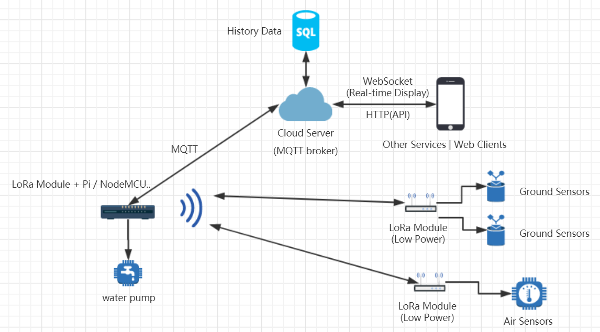

# LoRa PLAN

## System Architecture

## Objectives
 - Available
 - Reliable

## Devices
 - VPS x1
 - Gateway(Raspberry Pi / NodeMCU) x1
 - LoRa Module x5
 - ..MCU(Nano / STM32 / NodeMCU) x2

## Features
 - Key Point Low Power
 - Simple Network Topology
 - Provide HTTP and WebSocket API, Easy to support a Website/App Demo Page
 - Both the Water Pump unit and the Sensor unit are flexible to move

## Shortages
 - The selection of LoRa module is undetermined, hopefully we can decide it in two days after a talk with the iot company we used to study
 - Waterproof still need to be solved