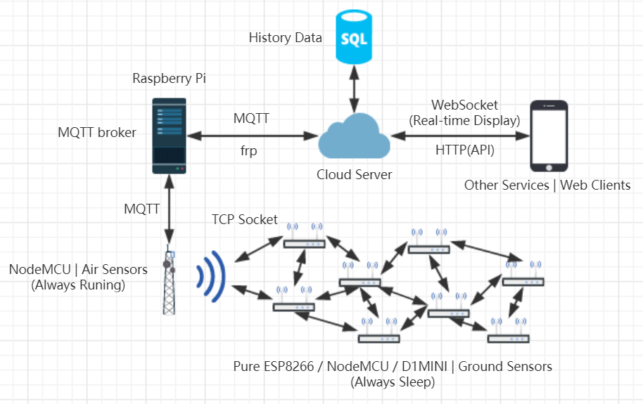
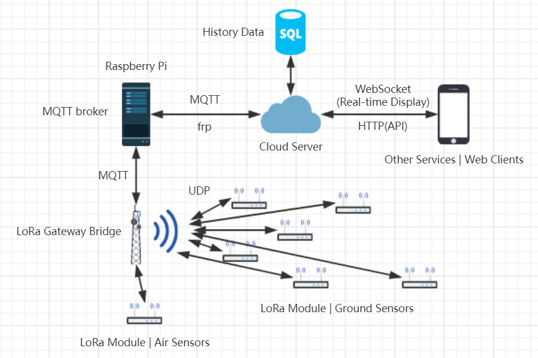
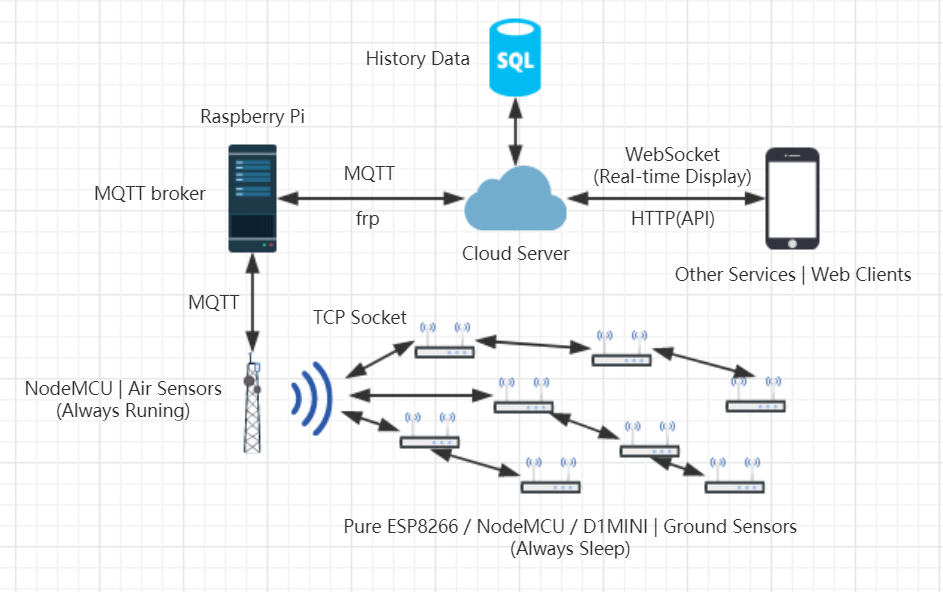
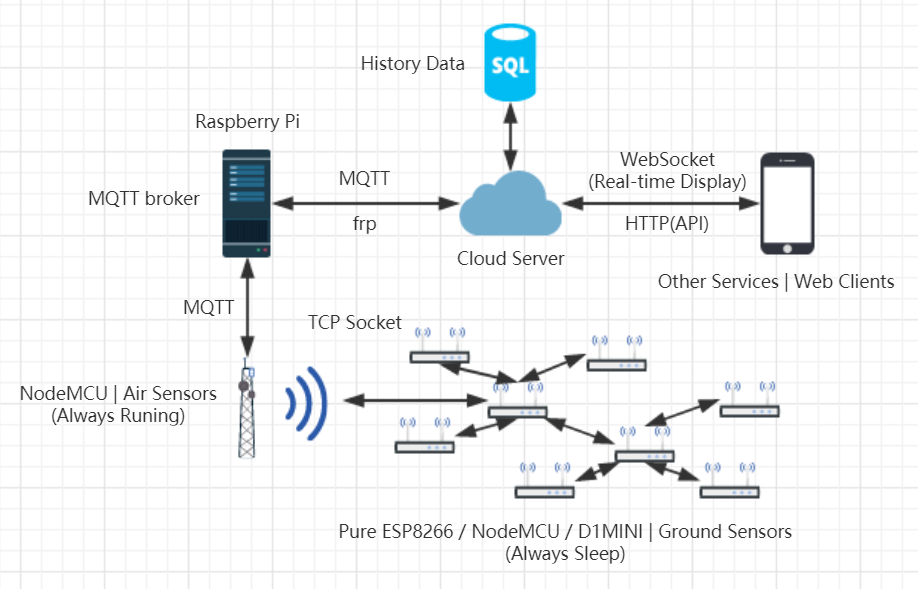
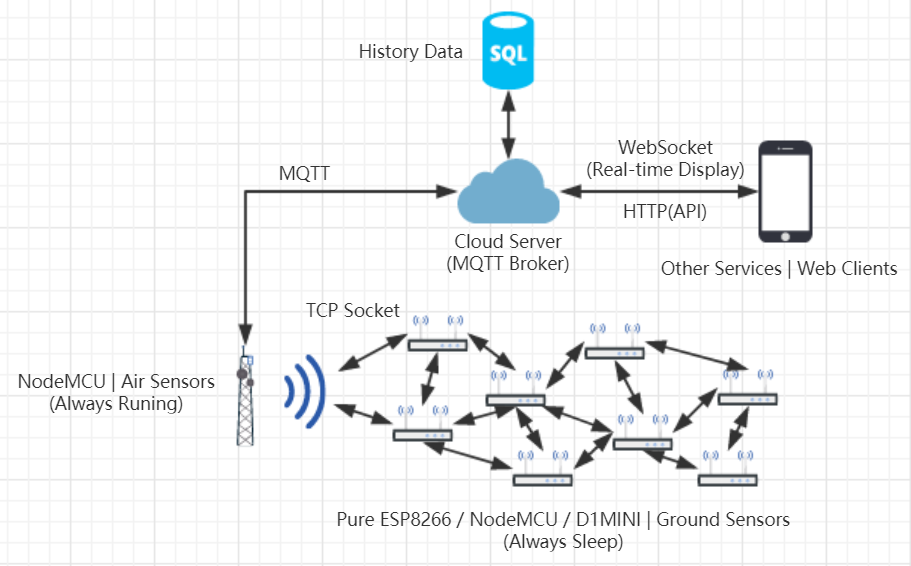
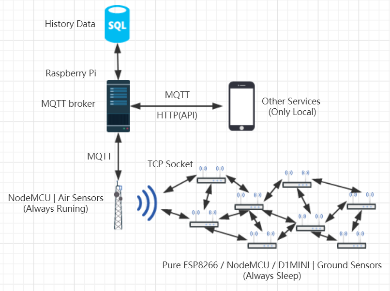

# Architecture Plans

## WIFI PLAN1

### System Architecture

### Devices
 - Raspberry Pi
 - VPS
 - NodeMCU
 - WiFi Router
 - ESP8266 /ESP-01/ D1 MINI / NodeMCU

### Features
 - Provide HTTP and Websocket API (Easy for App and Website Dev)
 - Provide History Data Access
 - API can be accessed from Internet
 - Ground Sensor network is flexible
 - Ground Sensor Network is low power
 - A NodeMCU collect data from air sensors and Ground Sensor Network and publish them through MQTT
 - The Cloud Server subscribe sensors through MQTT
 - The Cloud Server publish command through MQTT
 - The NodeMCU subscribe command subject through MQTT

### Advantages
 - Devices Easy to buy
 - Community support
 - Make full use of Existing Devices
 - Most of us are already familiar with WiFi and ESP8266
 - Cheap

### Shortages
 - WiFi is a HIGH Frequency Tech and may not suitable for farming iot
 - Cellular network may be unstable when there are huge number of nodes
 - Energy Comsumption is still a problem
 - Few papers for ESP8266 in Cellular Network

## LoRa PLAN1

### System Architecture

### Devices
 - Raspberry Pi
 - VPS
 - LoRa Gateway
 - LoRa Clients

### Features
 - Work on low frequency
 - LoRa Eco perfectly support MQTT
 - Can be implemented in real farms

### Advantages
 - Low Power
 - Stability had been proved
 - Cheap client Module
 - 10km+ effective radius

### Shortages
 - Cost a lot for buying LoRa Gateway (￥1000)
 - Few Community Support
 - Hard to purchase in market

## WIFI PLAN2

### System Architecture

### Devices
 - Raspberry Pi
 - VPS
 - NodeMCU
 - WiFi Router
 - ESP8266 / ESP-01 / D1 MINI / NodeMCU

### Features
 - Ground Sensor Network works as chains

### Advantages
 - Easy to develop
 - High Communicating Efficiency

### Shortages
 - One node offline can cause one chain offline

## WIFI PLAN3

### System Architecture

### Devices
 - Raspberry Pi
 - VPS
 - NodeMCU
 - WiFi Router
 - ESP8266 / ESP-01 / D1 MINI / NodeMCU

### Features
 - Ground Sensor Network works as branch

### Advantages
 - Good Communicating Efficiency
 - Easy to manage nodes

### Shortages
 - One node of main branch offline can cause whole network offline

## WIFI PLAN4

### System Architecture

### Devices
 - VPS
 - NodeMCU
 - WiFi Router
 - ESP8266 / ESP-01 / D1 MINI / NodeMCU

### Features
 - NodeMCU directly connect to a MQTT Cloud Server

### Advantages
 - No Internet Through Problem
 - Easy to manage

### Shortages
 - Rely on the internet condition
 - Relatively high time-delay for intranet request

## WIFI PLAN5

### System Architecture

### Devices
 - Raspberry Pi
 - NodeMCU
 - WiFi Router
 - ESP8266 / ESP-01 / D1 MINI / NodeMCU

### Features
 - All devices Local
 - No Cloud Support

### Advantages
 - Safe
 - Quickly respond to local request

### Shortages
 - Difficult to develop web service
 - Only support local access

# Comparation

| Plan | Cost | Purchase | Energy Consumption | Community | Communication Quality | Effective Radius | History Data | Safety | intranet MQTT | Network Complexity | Access from Internet |
| :----: | :----: | :-----: | :----: | :----: | :----: | :----: | :----: | :----: | :----: | :----: | :---: |
| WIFI1 | Low | Easy | Low (Deep Sleep) | Big | Unknown | unknown | Support | Good | Support | 5 | Support |
| LoRa1 | Relativly High | Hard | Very Low | Small | Good | 10+km | Support | Perfect | Support | 3 | Support |
| WIFI2 | Low | Easy | Low (Deep Sleep) | Big | Unknown | ok | Support | Good | Support | 4 | Support |
| WIFI3 | Low | Easy | Low (Deep Sleep) | Big | Unknown | ok | Support | Good | Support | 4 | Support |
| WIFI4 | Low | Easy | Low (Deep Sleep) | Big | Unknown | unknown | Support | Good | Not | 4 | Support |
| WIFI5 | Low | Easy | Low (Deep Sleep) | Big | Unknown | unknown | Support | Good | Support | 4 | Not |
