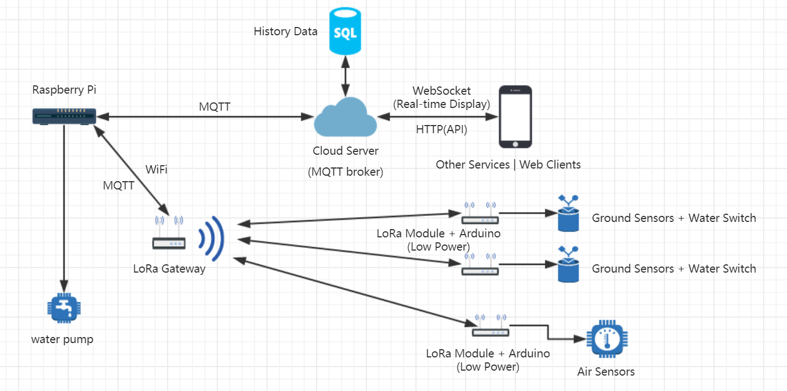

# Smart Farm System

## System Architecture

## Objectives
 - Available
 - Reliable
 - Sustainable

## Methodology
 - Interface Oriented Programming
 - Simplified Network Topology

## Devices
 - Raspberry Pi x 1
 - SI4438 x 4
 - Arduino x 3
 - NodeMCU x 1
 - Virtual Private Server(VPS) x 1

## Sensors

### Air Sensors
 - BME280 x 1
 - GY30 x 1
 - rain x 1
 - MQ135 x 1
 - MQ7 x 1

### Ground Sensors
 - LM35 x 2
 - Humidity x 2

## Water System

### Water Supply
 - Water pump x 1
 - pipe
 - Water Switch x 2

### Power Supply
 - Hydroelectric Generator
 - 12V Rechargeable Battery x 1
 - 5V Rechareable Battery x 2

## Telecommunication
 - 433MHz Radio Frequency (LoRa)
 - WiFi 802.11

## Messaging Protocol
 - MQTT
 - HTTP
 - WebSocket

