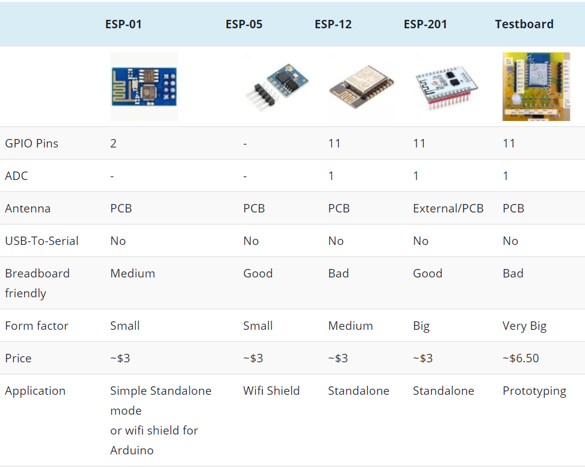
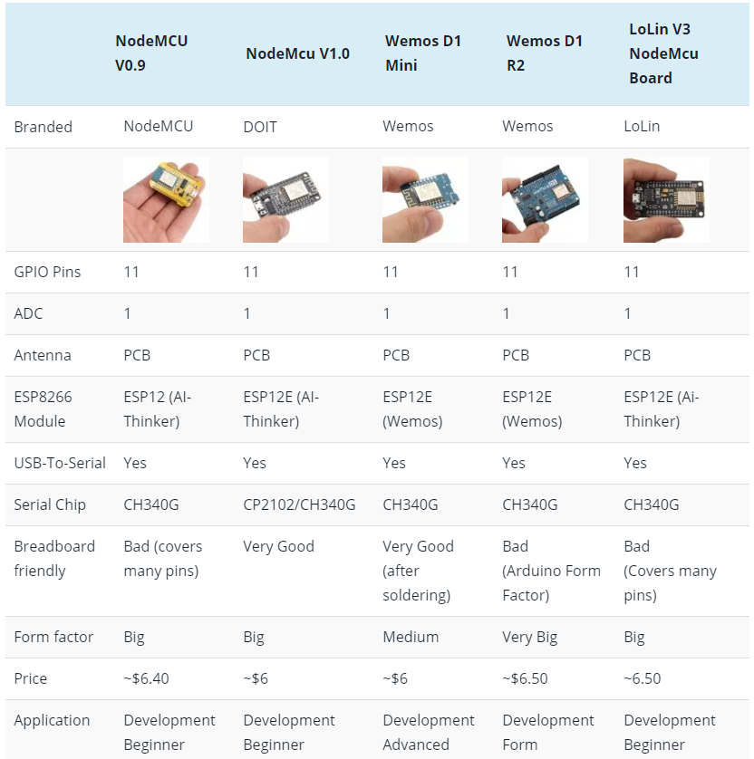
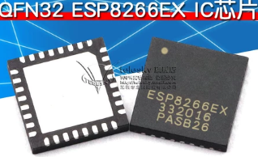
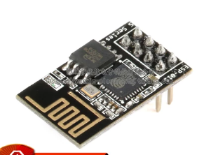
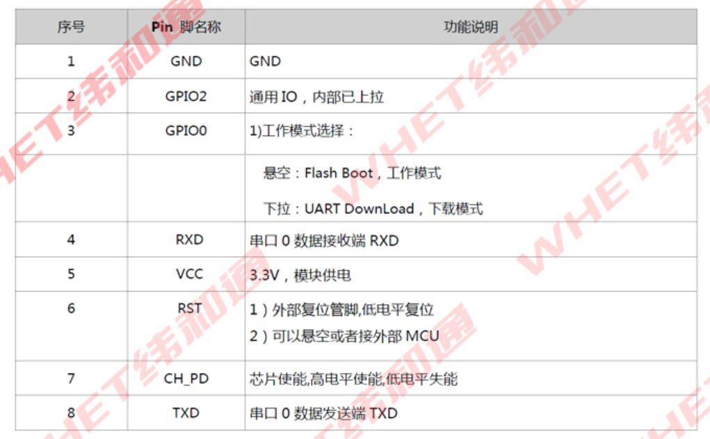
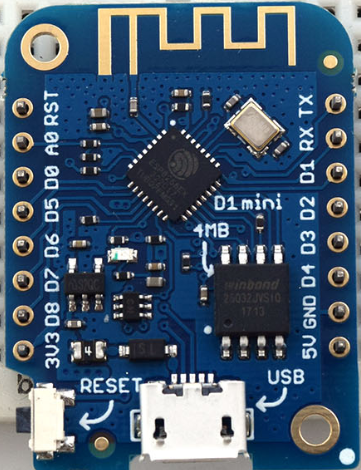
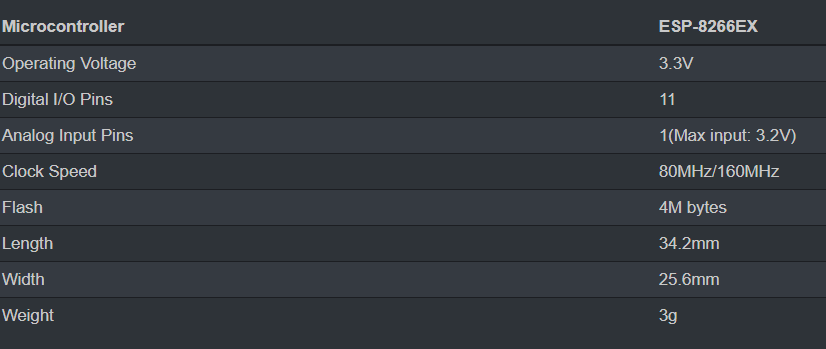
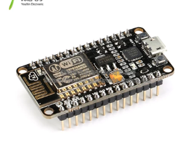

# Comparation

## Raw Modules

## Development Modules

# Specification

## ESP8266EX

### Picture

### Spec
 - Price: ￥3.5
 - Data Sheet [English](./.spec/esp8266ex_en.pdf) / [Chinese](./.spec/esp8266ex_cn.pdf)

## ESP-01
### Picture

### Spec
 - price: ￥9.4
 - Support Arduino IDE

### issues
 - 3.3v Power Supply need to be precise
 - New Version with 1M flash but hard to deep sleep

## Wemos D1 Mini

### Picture

### Spec
 - Price: ￥15.8
 - Support Arduino IDE
 - Support OTA

### NodeMCU

### Picture

### Spec
 - Price: ￥22
 - [Docs](https://nodemcu.readthedocs.io/en/master/)